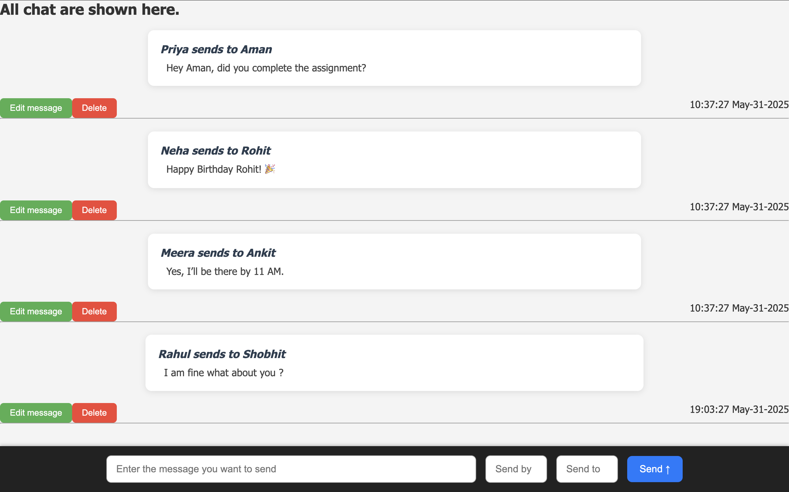
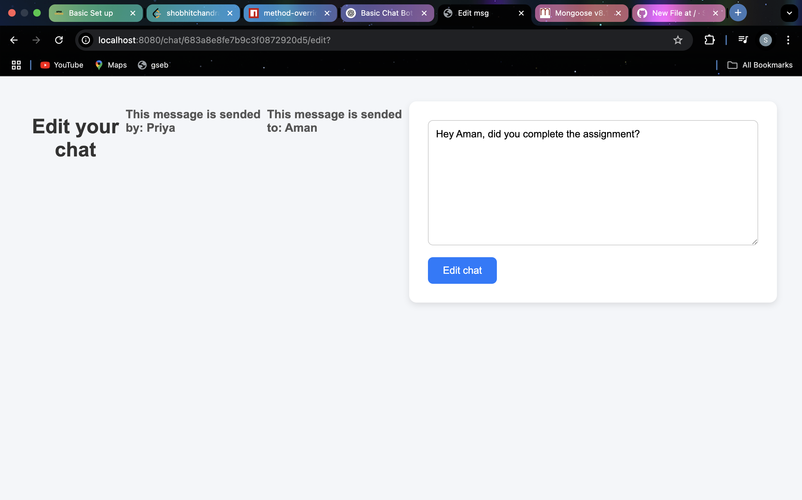

# 🗨️ Basic Chat Bot

A simple real-time chat bot where **anyone can send, edit, or delete** any message — no login, no restrictions. Built with **Node.js**, **Express**, and **Socket.io**.

---

## 🚀 Features

- ✅ Send Messages
- ✏️ Edit Any Message
- ❌ Delete Any Message
- 🔁 Real-time Updates via WebSockets

> ⚠️ No authentication — all messages can be edited/deleted by any user.

---

## 📸 Demo




---

## 🛠️ Tech Stack

- **Frontend**: HTML, CSS, JavaScript
- **Backend**: Node.js + Express
- **Database**: MongoDB
- **Restful api's** concepts are used. 

---

## 📦 Installation

1. **Clone the Repository**
   ```bash
   git clone https://github.com/your-username/basic-chat-bot.git
   cd basic-chat-bot
